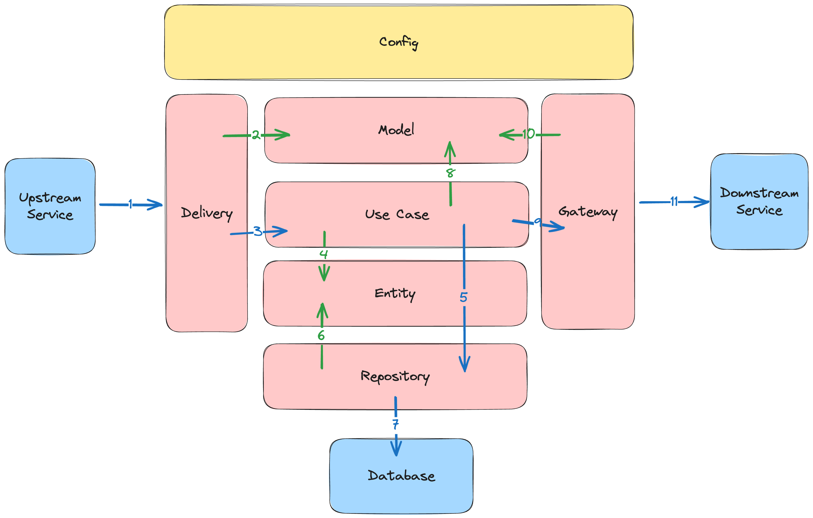
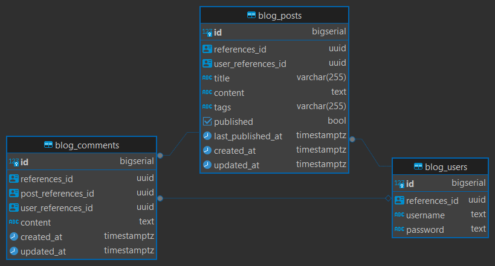

# Blog System - Golang Clean Architecture

## Description

A simple blog system built with Golang following Clean Architecture principles. This application demonstrates a RESTful
API for managing blog posts with CRUD operations, pagination, filtering, and authentication.

## Features

- **Blog Post Management**: Create, read, update, and delete blog posts
- **Pagination & Filtering**: Efficient data retrieval with customizable filters
- **Authentication**: Secure endpoints with Bearer token authentication
- **Clean Architecture**: Separation of concerns with clear layer boundaries
- **API Documentation**: Interactive Swagger/OpenAPI documentation
- **Database Migrations**: Version-controlled database schema changes

## Architecture



### Architecture Flow

1. External system performs request (HTTP, gRPC, Messaging, etc)
2. The Delivery layer creates various Model from request data
3. The Delivery calls Use Case, and executes it using Model data
4. The Use Case creates Entity data for the business logic
5. The Use Case calls Repository, and executes it using Entity data
6. The Repository uses Entity data to perform database operation
7. The Repository performs database operation to the database
8. The Use Case creates various Model for Gateway or from Entity data
9. The Use Case calls Gateway, and executes it using Model data
10. The Gateway uses Model data to construct request to external system
11. The Gateway performs request to external system (HTTP, gRPC, Messaging, etc)

### Layer Responsibilities

- **Delivery Layer** (`internal/delivery/http`): HTTP handlers, request/response handling, routing
- **Service Layer** (`internal/services`): Business logic, use case implementation
- **Repository Layer** (`internal/repository`): Data access, database operations
- **Model Layer** (`internal/model`): Request/response DTOs, data transfer objects
- **Entity Layer** (`internal/entity`): Domain models, business entities

### Database Schema



This database schema supports a simple blog system with three main tables:

- **blog_users**: Stores user accounts with username and password for authentication. Each user has a unique UUID
  reference identifier.

- **blog_posts**: Contains blog content created by users. Posts include title, content, tags, publication status, and
  timestamps. Each post is linked to its author via `user_references_id`. When a user is deleted, their posts are
  automatically removed (CASCADE).

- **blog_comments**: Manages comments on blog posts. Comments reference both the post and optionally the commenting
  user. If a post is deleted, its comments are removed automatically. If a user is deleted, their comments remain but
  the user reference is set to NULL.

The schema uses UUID-based references for flexible external system integration while maintaining auto-incrementing IDs
for internal operations. Foreign key constraints ensure data integrity with appropriate cascade and nullification rules.
## Tech Stack

- **Golang** : https://github.com/golang/go
- **PostgreSQL** (Database) : https://github.com/postgres/postgres

## Framework & Library

- **Gin** (HTTP Framework) : https://github.com/gin-gonic/gin - High-performance HTTP router and middleware framework
  for building RESTful APIs with excellent routing capabilities, used for handling all HTTP endpoints in this blog
  system
- **GORM** (ORM) : https://github.com/go-gorm/gorm - Type-safe ORM providing database abstraction layer for PostgreSQL,
  enabling clean repository pattern implementation with automatic migrations and query building for blog posts,
  comments, and user management
- **Viper** (Configuration) : https://github.com/spf13/viper - Flexible configuration management supporting multiple
  formats (JSON, YAML, ENV), allowing environment-specific settings for database connections, server ports, and
  application behavior across development and production environments
- **Go Playground Validator** (Validation) : https://github.com/go-playground/validator - Struct-based validation
  library for enforcing business rules and data integrity on incoming HTTP requests, ensuring valid blog post content,
  user registration data, and comment submissions before processing
- **Slog** (Structured Logger) : Standard library structured logging for consistent, level-based logging throughout the
  application with JSON output support, providing observability for API requests, database operations, and error
  tracking
- **Swag** (Swagger Documentation) : https://github.com/swaggo/swag - Automatic OpenAPI/Swagger documentation generation
  from Go annotations, providing interactive API documentation accessible at `/docs` for easy API exploration and
  testing

## Setup and Running Instructions

### Prerequisites

- Go 1.25 or higher
- Postgres 14 or higher

### Installation

1. **Clone the repository**
   ```bash
   git clone <repository-url>
   cd blog-system
   ```

2. **Install dependencies (optional)**
   ```bash
   go mod download
   ```

3. **Configure the application**

   Copy the example environment file and fill in your configuration:
   ```bash
   cp .env.example .env
   ```

   Update `.env` with your database and application settings.

4. **Run the application**

   You can run the application in two ways:

   **Via Docker:**
   ```bash
   docker compose up -d
   ```

   **Local Development:**
   ```bash
   go run cmd/web/main.go
   ```

   > **Note:** Database migrations will run automatically when the program starts.

5. **Generate Swagger documentation** (Optional)
   ```bash
   swag init -g cmd/web/main.go
   ```